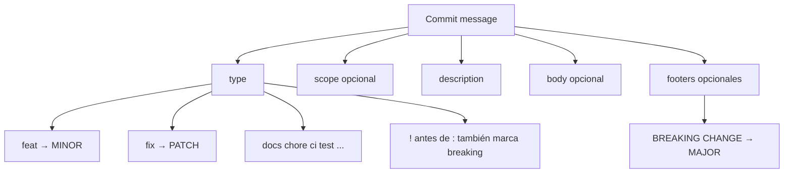

# Conventional Commits v1.0.0

> [!summary] Idea en una frase
> Convención ligera para mensajes de commit que hace el historial **explícito** y automatizable (CHANGELOG, SemVer, CI).

## Mapa mental



## Estructura

```
<type>[optional scope][!]: <description>

[optional body]

[optional footer(s)]
```

## Tipos que más vas a usar

| Tipo | SemVer / uso |
|---|---|
| `feat` | Nueva capacidad → MINOR |
| `fix` | Bug → PATCH |
| `docs` | Solo documentación |
| `chore` | Mantenimiento (scaffolds, configs) |
| `ci` | Pipelines |
| `refactor` | Cambio interno sin feat/fix |
| `test` | Tests |
| `perf` | Performance |

> [!tip] Scope
> `feat(api): ...` o `fix(gate): ...` para ubicar el área.

## Breaking changes

1. Footer: `BREAKING CHANGE: descripción`
2. O `!` tras type/scope: `feat(api)!: ...`

## Ejemplos mínimos

```
docs: correct spelling of CHANGELOG
```

```
feat(lang): add Polish language
```

```
fix: prevent racing of requests

Introduce a request id and dismiss stale responses.
```

```
feat!: drop support for Node 6

BREAKING CHANGE: use JS features not available in Node 6.
```

## Por qué importa (curso + trabajo)

- Historial legible en PRs de equipo.
- Base para **release notes** y bumps SemVer.
- En TC5062 la rúbrica pide Conventional Commits en el repo.
- En DE/Platform, commits claros ayudan en code review y auditoría de cambios (incl. prompts/config si versionas artefactos).

## Flashcards

Q:: ¿Qué type usa Conventional Commits para una feature nueva?
A:: `feat` (correla con MINOR en SemVer).

Q:: ¿Cómo marcas un breaking change sin footer largo?
A:: Pon `!` antes de `:` en el prefijo, p. ej. `feat!: ...`.

Q:: ¿`chore` obliga un bump SemVer?
A:: No; solo `feat`/`fix`/BREAKING tienen correlación SemVer estándar.

## Autoevaluación

1. Reescribe `Updated stuff in API` a Conventional Commits.
2. ¿Qué haces si un commit mezcla feat y fix? (Ideal: partir en dos commits.)
3. Relaciona `fix` / `feat` / `BREAKING CHANGE` con PATCH / MINOR / MAJOR.

## Referencias

- [Conventional Commits v1.0.0](https://www.conventionalcommits.org/en/v1.0.0/)
- Chacon & Straub, *Pro Git*
